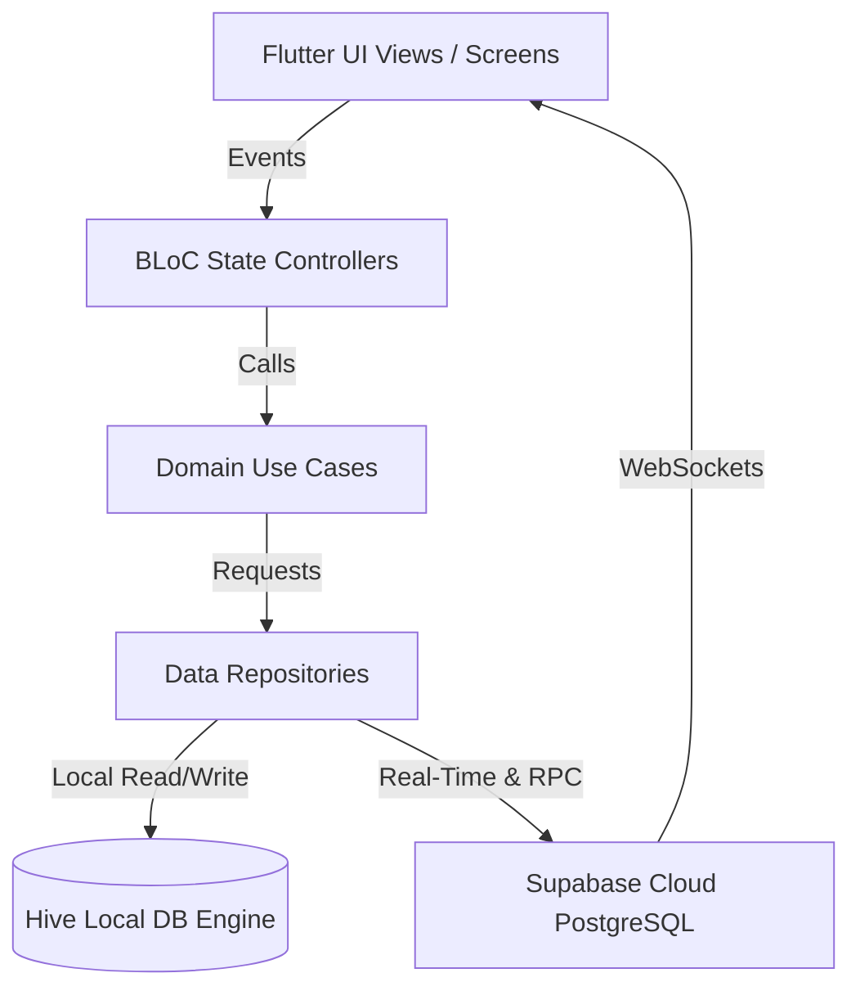
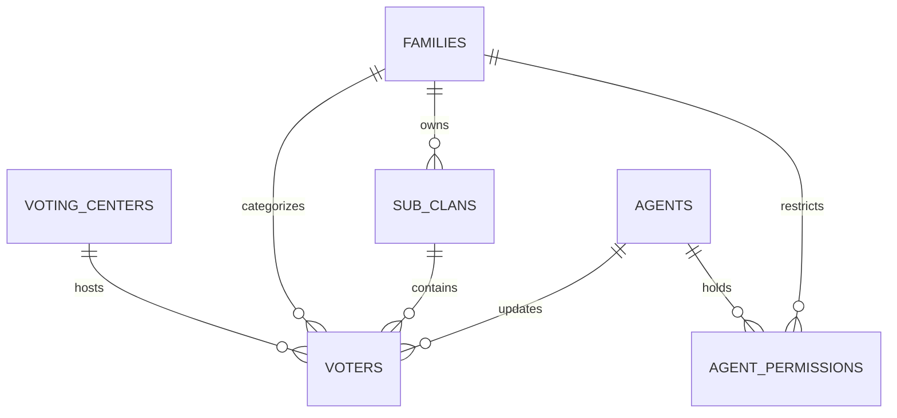

# 🗳️ Vote IQ — Voter Tracking & Election Campaign System

[](https://flutter.dev)
[](https://dart.dev)
[](https://supabase.com)
[](https://postgresql.org)
[](https://bloclibrary.dev)
[](#-offline-first--real-time-sync)
[](#-security--row-level-security-rls)

> **An Enterprise-Grade, Real-Time Voter Tracking & Campaign Management Platform powered by Flutter, BLoC Architecture, Supabase, and Offline-First Local Caching.**

---

🌐 **Language Options**: [العربية (Arabic Version)](README_AR.md) | **English**

---

## 📌 Table of Contents

- [Executive Summary](#-executive-summary)
- [Key Feature Highlights](#-key-feature-highlights)
- [System Architecture](#-system-architecture)
- [Database Schema & RLS Security](#-database-schema--rls-security)
- [Offline-First & Real-Time Sync](#-offline-first--real-time-sync)
- [Project Directory Structure](#-project-directory-structure)
- [Getting Started & Local Setup](#-getting-started--local-setup)
- [Data Export & Reporting Engine](#-data-export--reporting-engine)
- [License & Attribution](#-license--attribution)

---

## 🎯 Executive Summary

**Vote IQ** is a state-of-the-art election campaign and voter turnout management platform built for election observers, campaign managers, and field agents. It enables real-time tracking of voter participation ("Voted", "Has Not Voted", "Refused") across voting centers, family branches, and sub-clans.

Designed for high-concurrency field operations, **Vote IQ** combines **Supabase Real-time WebSockets** with **Hive Offline-First local storage**, ensuring zero downtime and field agent data continuity even in connectivity-challenged locations.

---

## ✨ Key Feature Highlights

### ⚡ 1. Real-Time Voter Turnout Tracking
- **Instant Status Sync**: Live state updates ("Has Not Voted", "Voted", "Refused") broadcasted instantly across all connected agents via Supabase WebSockets.
- **Refusal Reason Analytics**: Track and classify voter hesitation or refusal reasons for target field follow-ups.

### 👥 2. Hierarchical Clan & Family Grouping
- **Multi-Level Hierarchy**: Organizes voters into Voting Centers $\rightarrow$ Major Families $\rightarrow$ Sub-clans $\rightarrow$ Household Units.
- **Household Role Ranking**: Built-in ordering logic prioritizing household heads (`Husband` $\rightarrow$ `Wife` $\rightarrow$ `Child` $\rightarrow$ `Other`).

### 👮 3. Agent Delegation & Granular Security
- **Role-Based Access Control**: Distinguishes between `Super Admin` and field `Agent` roles.
- **Scope Restriction**: Assigns specific family branches or polling centers to field agents via database Row-Level Security (RLS).

### 📴 4. Offline-First Architecture & Resilient Caching
- **Hive Local Store**: Full voter registry cached locally on-device.
- **Automatic Sync Pipeline**: Outbound mutations queued locally during connection drops and synchronized automatically upon reconnect using `connectivity_plus`.

### 📊 5. Dynamic Analytics Dashboard & Visual Charts
- **Interactive Graphs**: Powered by `fl_chart` to visualize real-time turnout metrics, center breakdown, and target goals.
- **Speed Indexing**: Uses GIN Trigram indexes (`pg_trgm`) for sub-second voter lookup across thousands of records.

### 📄 6. Multi-Format Report Generation
- **Excel Export**: Export voter rolls and status reports directly to Microsoft Excel format (`.xlsx`).
- **PDF Printable Rosters**: Generate printable high-resolution PDF rosters formatted for Arabic RTL.

---

## 🏗️ System Architecture

Vote IQ utilizes **Clean Architecture** powered by the **BLoC (Business Logic Component)** pattern and **GetIt** service locator:



---

## 🔒 Database Schema & RLS Security

The database schema (`supabase_schema.sql`) enforces strict security policies at the PostgreSQL engine level:



| Table Name | Purpose | Key Constraints |
| :--- | :--- | :--- |
| `voting_centers` | Registry of physical polling stations | `center_name` (UNIQUE) |
| `families` | Primary tribal / family groupings | `family_name` (UNIQUE) |
| `sub_clans` | Sub-branches of primary families | Composite UNIQUE (`family_id`, `sub_name`) |
| `agents` | System users, field agents, admins | Role CHECK (`admin`, `agent`), UUID PK |
| `agent_permissions` | Granular agent scope mapping | Foreign keys to `families` & `sub_clans` |
| `voters` | Central voter registry | `search_text` GIN indexed, status CHECK |

### Row-Level Security (RLS) Policies
- `voters_admin_all`: Super administrators have unrestricted CRUD access across all tables.
- `voters_agent_access`: Field agents can only view/update voters belonging to their explicitly assigned family branches or sub-clans.
- `voters_agent_no_delete`: Hard-deletion of voter records is strictly restricted to Admin users.

---

## 📁 Project Directory Structure

```text
Vote_iq/
 ├── docs/                          # Campaign rollout documentation
 │    └── household-rollout-plan.md
 ├── supabase_schema.sql            # Master PostgreSQL schema & RLS policies
 ├── generate_qaffin_excel.dart     # Data generator & seeding utilities
 ├── lib/                           # Dart Source Code
 │    ├── main.dart                 # App initialization & Supabase client bootstrap
 │    ├── app.dart                  # Material App & global BLoC providers
 │    ├── core/                     # Core utilities & shared infrastructure
 │    │    ├── error/               # Failures & Exception handling
 │    │    ├── network/             # Network info & connectivity checks
 │    │    ├── security/            # Secure storage & token handlers
 │    │    └── usecases/            # Base UseCase contracts
 │    ├── data/                     # Data layer implementation
 │    │    ├── datasources/         # Supabase & Hive local datasources
 │    │    ├── models/              # DTO JSON Mappers
 │    │    └── repositories/        # Repository implementations
 │    ├── domain/                   # Domain entities & business rules
 │    │    ├── entities/            # Immutable core domain objects
 │    │    ├── repositories/        # Repository interfaces
 │    │    └── usecases/            # Voter & Agent usecases
 │    └── presentation/             # UI Layer (BLoC + Screens)
 │         ├── agents/              # Agent management screens
 │         ├── auth/                # Login & authentication UI
 │         ├── dashboard/           # Turnout charts & analytics
 │         ├── home/                # Main application shell
 │         ├── lookup/              # Fast voter lookup & search
 │         ├── sync/                # Offline sync management
 │         └── voters/              # Voter detail & edit screens
```

---

## 💻 Multi-Platform Support

Built with Flutter 3.11+, Vote IQ targets:
- 📱 **Mobile (Android & iOS)** — Primary field agent deployment
- 💻 **Desktop (Windows & macOS)** — Admin command centers
- 🌐 **Web Browsers** — Executive dashboard monitoring

---

## 🚀 Getting Started & Local Setup

### Prerequisites
- **Flutter SDK**: `^3.11.1` or higher
- **Dart SDK**: `>=3.11.1 <4.0.0`
- **Supabase Account & Project**

### 1. Database Setup (Supabase)
1. Create a new project on [Supabase](https://supabase.com).
2. Open the **SQL Editor** in your Supabase dashboard.
3. Paste and run the entire contents of [`supabase_schema.sql`](supabase_schema.sql).

### 2. Application Setup

1. **Clone the Repository**:
   ```bash
   git clone https://github.com/Mohmmad-alaa/Vote_iq.git
   cd Vote_iq
   ```

2. **Install Dependencies**:
   ```bash
   flutter pub get
   ```

3. **Configure Supabase Credentials**:
   Update your credentials in `lib/main.dart`:
   ```dart
   await Supabase.initialize(
     url: 'YOUR_SUPABASE_URL',
     anonKey: 'YOUR_SUPABASE_ANON_KEY',
   );
   ```

4. **Run Application**:
   - **Android / iOS**:
     ```bash
     flutter run
     ```
   - **Windows Desktop**:
     ```bash
     flutter run -d windows
     ```

---

## 📑 Data Export & Reporting Engine

Vote IQ includes a reporting suite for campaign management:
- **Excel Report Generator**: `generate_qaffin_excel.dart` script for converting voter databases into structured Excel sheets.
- **Live Printable PDF Cards**: Print voter passes and voting center rosters natively.

---

## 📄 License & Attribution

Developed by **Mohmmad Alaa**. All rights reserved © 2026.
