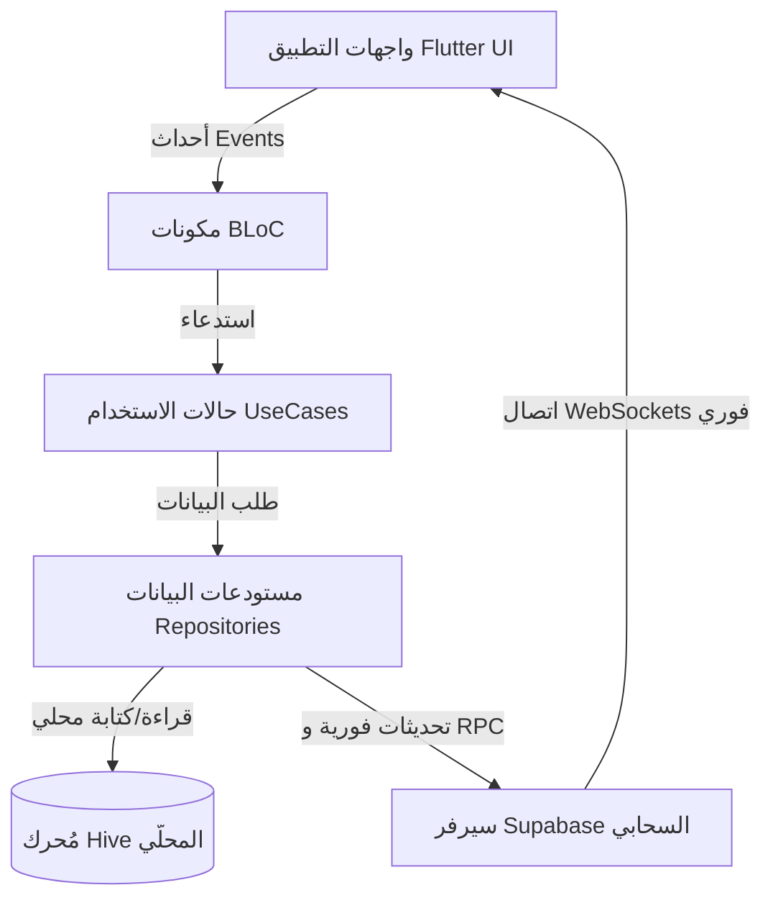
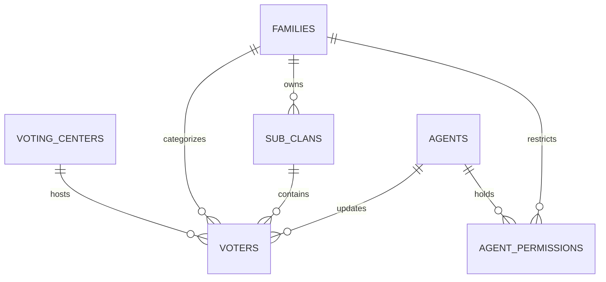

# 🗳️ Vote IQ — نظام إدارة وتتبع الناخبين للحملات الانتخابية
> **منصة إلكترونية متكاملة لتتبع نسبة الإقبال والتصويت الميداني فورياً بدعم Supabase وتخزين Offline-First.**

[](https://flutter.dev)
[](https://dart.dev)
[](https://supabase.com)
[](https://postgresql.org)
[](https://bloclibrary.dev)
[](#-التخزين-المحلي-والمزامنة-الفورية)
[](#-الأمان-وسياسات-مستوى-السطر-rls)

---

🌐 **خيارات اللغة**: [English Version](README.md) | **العربية**

---

## 📌 فهرس المحتويات

- [نبذة عن المشروع](#-نبذة-عن-المشروع)
- [أبرز المميزات والخصائص](#-أبرز-المميزات-والخصائص)
- [معمارية النظام (Architecture)](#-معمارية-النظام-architecture)
- [هيكلية قاعدة البيانات وسياسات الأمان RLS](#-هيكلية-قاعدة-البيانات-وسياسات-الأمان-rls)
- [التخزين المحلي والمزامنة الفورية](#-التخزين-المحلي-والمزامنة-الفورية)
- [دليل مجلدات المشروع](#-دليل-مجلدات-المشروع)
- [متطلبات وخطوات التثبيت](#-متطلبات-وخطوات-التثبيت)
- [محرك التقارير وتصدير البيانات](#-محرك-التقارير-وتصدير-البيانات)
- [حقوق الملكية والترخيص](#-حقوق-الملكية-والترخيص)

---

## 🎯 نبذة عن المشروع

تطبيق **Vote IQ** هو نظام رقمي ذكي مخصص لإدارة الحملات الانتخابية ومتابعة حركة الناخبين ميدانياً في يوم الاقتراع. يتيح التطبيق لمشرفي الحملة والوكلاء الميدانيين تتبع حالة تصويت الناخبين (*تم التصويت*، *لم يصوت*، *رفض*) بشكل لحظي وبأعلى درجات الدقة والسرعة.

تم تصميم النظام ليعمل بكفاءة عالية تحت ظروف الضغط الميداني وضغط الشبكات، حيث يدمج بين قوة **Supabase Real-Time WebSockets** للتحديث الفوري، وتقنية **Hive Offline-First** للتخزين المحلي وضمان عدم فقدان أي بيانات عند انقطاع الاتصال.

---

## ✨ أبرز المميزات والخصائص

### ⚡ 1. التتبع الفوري لنظريات الإقبال والتصويت
- **المزامنة اللحظية**: تحديث حالة تصويت الناخبين فورياً عبر جميع أجهزة الوكلاء والمشرفين باستخدام تقنية WebSockets.
- **تسجيل أسباب الامتناع**: توثيق أسباب رفض أو تردد الناخبين لتمكين فرق المتابعة الميدانية من التدخل السريع.

### 👥 2. الهيكلية العائلية والعشائرية
- **تسلسل هرمي متعدد المستويات**: تنظيم الناخبين بحسب مراكز الاقتراع $\rightarrow$ العائلات الرئيسية $\rightarrow$ الفروع العائلية (Sub-clans) $\rightarrow$ المجموعات الأسرية.
- **ترتيب رتبة الأسرة**: ترتيب تلقائي أفراده يبدأ من (`الزوج` $\rightarrow$ `الزوجة` $\rightarrow$ `الأبناء` $\rightarrow$ `غير ذلك`).

### 👮 3. إدارة الوكلاء والصلاحيات الدقيقة
- **نظام الأدوار**: تمييز صلاحيات *مدير النظام (Admin)* عن *الوكيل الميداني (Agent)*.
- **تحديد نطاق الوصول**: تقييد رؤية وتعديل الوكيل لعائلات أو فروع أو مراكز اقتراع محددة عبر سياسات Row-Level Security (RLS).

### 📴 4. العمل بدون إنترنت (Offline-First Architecture)
- **قاعدة بيانات Hive المحلية**: تخزين كامل سجل الناخبين محلياً على الجهاز.
- **طابور المزامنة التلقائي**: حفظ التعديلات محلياً عند انقطاع الشبكة، وإعادتها فورياً للسيرفر فور عودة الاتصال باستخدام `connectivity_plus`.

### 📊 5. لوحة تحليلات وإحصائيات تفاعلية
- **رسومات بيانية موجهة**: دعم مكتبة `fl_chart` للتمثيل البياني لنسب الإقبال بحسب المراكز والعائلات.
- **سرعة بحث فائقة**: استخدام فهارس GIN Trigram (`pg_trgm`) للبحث السريع في أجزاء من الثانية ضمن آلاف الأسماء والأرقام.

### 📄 6. تصدير التقارير والطباعة
- **تصدير إكسل (Excel)**: توليد قوائم الناخبين وإحصائيات الحملة في ملفات إكسل `.xlsx` رسمية.
- **طباعة تقارير PDF**: إنشاء كشوفات جاهزة للطباعة تدعم اللغة العربية والاتجاه من اليمين لليسار.

---

## 🏗️ معمارية النظام (Architecture)

يعتمد التطبيق على معمارية **Clean Architecture** الموزعة على طبقات محددة باستخدام نمط **BLoC (Business Logic Component)** وموفّر الخدمات **GetIt**:



---

## 🔒 هيكلية قاعدة البيانات وسياسات الأمان RLS

تم بناء قاعدة البيانات (`supabase_schema.sql`) على محرك **PostgreSQL** المتقدم لضمان التكامل المرجعي وأعلى درجات الحماية:



| اسم الجدول | الغرض | القيود الأساسية |
| :--- | :--- | :--- |
| `voting_centers` | سجل مراكز الاقتراع والمحطات | اسم المركز فريد (UNIQUE) |
| `families` | العائلات والحمولات الرئيسية | اسم العائلة فريد (UNIQUE) |
| `sub_clans` | الفروع العائلية التفصيلية | قيد مركب (`family_id`, `sub_name`) |
| `agents` | حسابات الوكلاء والمشرفين | قيد الدور (`admin`, `agent`), UUID |
| `agent_permissions` | صلاحيات الوكيل المخصصة | مفاتيح أجنبية لجدولي العائلات والفروع |
| `voters` | السجل المركزي للناخبين | مفهرس بنمط GIN للبحث السريع |

### سياسات الأمان RLS (Row-Level Security)
- **`voters_admin_all`**: يمتلك الأدمن صلاحيات كاملة لقراءة وتعديل وحذف كافة البيانات.
- **`voters_agent_access`**: يقتصر وصول الوكيل فقط على الناخبين التابعين للعائلات أو الفروع المصرح له بها في جدول الصلاحيات.
- **`voters_agent_no_delete`**: يُمنع الوكلاء الميدانيون من حذف أي سجل للناخبين نهائياً.

---

## 📁 دليل مجلدات المشروع

```text
Vote_iq/
 ├── docs/                          # وثائق وخطط توزيع المجموعات الأسرية
 │    └── household-rollout-plan.md
 ├── supabase_schema.sql            # مخطط السكيمات وسياسات RLS الكاملة
 ├── generate_qaffin_excel.dart     # أداة توليد وتوليد ملفات الإكسل للأصناف
 ├── lib/                           # الكود المصدري بلغة Dart
 │    ├── main.dart                 # نقطة الانطلاق وتهيئة محرك Supabase
 │    ├── app.dart                  # تطبيق MaterialApp وموفرات BLoC
 │    ├── core/                     # الخدمات المركزية والأخطاء والشبكة
 │    ├── data/                     # مصادر البيانات المباشرة والمحلية والمحولات
 │    ├── domain/                   # الكيانات الرئيسية وقواعد العمل وحالات الاستخدام
 │    └── presentation/             # طبقة واجهات المستخدم وشاشات BLoC
 │         ├── agents/              # شاشات إدارة الوكلاء والصلاحيات
 │         ├── auth/                # واجهات تسجيل الدخول والتوثيق
 │         ├── dashboard/           # لوحة الإحصائيات والرسومات البيانية
 │         ├── home/                # الغلاف الرئيسي للتطبيق
 │         ├── lookup/              # محرك البحث الفوري عن الناخبين
 │         ├── sync/                # إدارة المزامنة والعمل بدون إنترنت
 │         └── voters/              # شاشات تفاصيل وتعديل حالة الناخبين
```

---

## 💻 دعم المنصات المتعددة

يدعم تطبيق Vote IQ العمل عبر المنصات التالية:
- 📱 **الهواتف الذكية (Android & iOS)** — البيئة الأساسية للوكلاء الميدانيين.
- 💻 **سطح المكتب (Windows & macOS)** — لإدارة غرف العمليات والمشرفين.
- 🌐 **متصفحات الويب (Web)** — لمعاينة اللوحات الإحصائية فورياً.

---

## 🚀 متطلبات وخطوات التثبيت

### المتطلبات الأساسية
- **Flutter SDK**: `^3.11.1` أو أحدث.
- **Dart SDK**: `>= 3.11.1 < 4.0.0`.
- **حساب مشروع Supabase**.

### 1. إعداد قاعدة البيانات على Supabase
1. أنشئ مشروعاً جديداً على موقع [Supabase](https://supabase.com).
2. افتح محرر الـ **SQL Editor** داخل لوحة التحكم.
3. قم بنسخ وتنفيذ محتوى الملف [`supabase_schema.sql`](supabase_schema.sql).

### 2. إعداد وتبيئة التطبيق

1. **استنساخ المستودع**:
   ```bash
   git clone https://github.com/Mohmmad-alaa/Vote_iq.git
   cd Vote_iq
   ```

2. **تحميل التبعيات**:
   ```bash
   flutter pub get
   ```

3. **إضافة مفاتيح Supabase**:
   قم بتحديث مفاتيح الاتصال في ملف `lib/main.dart`:
   ```dart
   await Supabase.initialize(
     url: 'YOUR_SUPABASE_URL',
     anonKey: 'YOUR_SUPABASE_ANON_KEY',
   );
   ```

4. **تشغيل التطبيق**:
   ```bash
   flutter run
   ```

---

## 📄 حقوق الملكية والترخيص

تم تطوير المشروع بواسطة **Mohmmad Alaa**. جميع الحقوق محفوظة © 2026.
